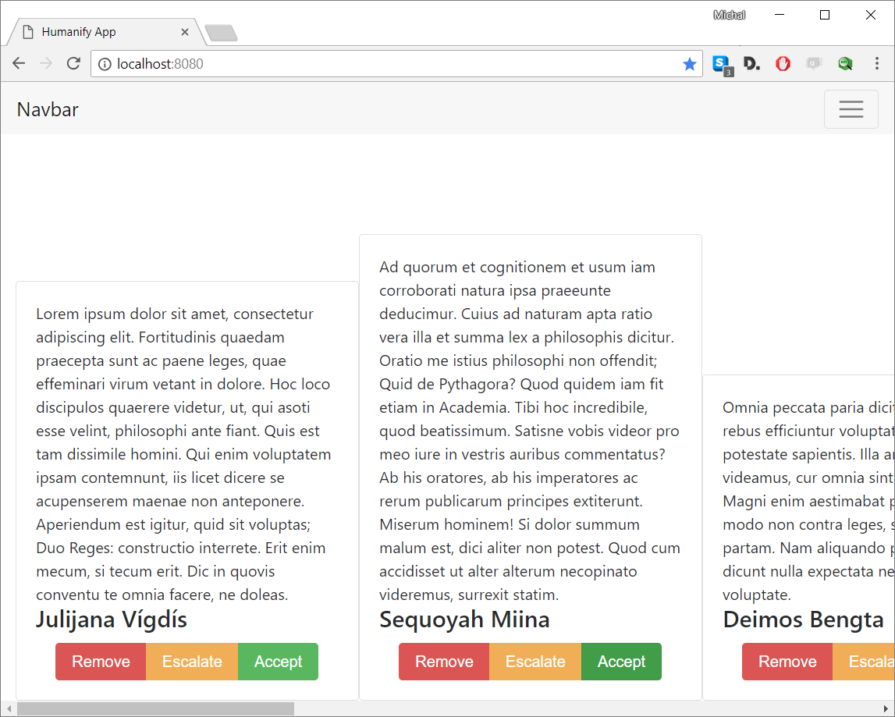

## What does it do?

**Humanify** is a free and open source server and web application, written in Node.js, that allows adding human intelligence to data streaming in scenarios where computers are not suitable to make.

In just a couple lines of code **Humanify** will ingest your data stream, open an HTTP server with a WebApplication that will be fed with all the data from the stream. Now you and your team can add decisions to each item of your data stream.

Think of it as an open-source, on-premise alternative to Amazon Mechanical Turk that you can alter to your own liking.

## State of system

What you're looking at is a system that has been successfully used by [Signicode](https://www.signicode.com) in a number of business cases as the company's internal software. This here is an early release that will undergo major development in the following months.

As an interface though you may expect that no breaking changes are intended to be introduced to the current API - so feel free to post an issue if we do, we'll be fixing those as soon as possible.

## Usage

```javascript
    const { Humanify } = require("humanify");

    streamOfRequests.pipe(new Humanify({buttons: [
        {value: 0, caption: 'Remove', type: 'danger', kb: ['rR', 39]},
        {value: 2, caption: 'Escalate', type: 'warning', kb: ['eE', 38]},
        {value: 1, caption: 'Accept', type: 'success', kb: ['aA', 37]},
    ]})).listen(8080)
    // do something with your data-stream
```

This results in an app like this:



## API

Humanify is based on [`scramjet..DataStream`](https://github.com/signicode/scramjet#datastream--streampassthrough) so you can use all methods there.

Humanify exposes the following methods on the resulting stream:

* `constructor(options)` - creates the stream
* `listen(...args)` - starts listening to the server (args are passed to node built-in `HttpServer..listen` method)

Options are:

* `serialize` - serialization method for your data (default: `JSON.stringify`)
* `deserialize` - serialization method for your data (default: `JSON.parse`)
* `root` - root path for application to start (default: public folder in humanify root)
* `buttons` - list of buttons that are show to users
* `maxBufferLength` - how many items to show to users
* `logger` - logger to use, default: `console`

Button definition:

```javascript
    {
        value: 1,           // the value that's pushed to the output stream
        caption: 'yes',     // what should be shown on the buttons
        type: 'primary',    // bootstrap type (in essence it's the button's class)
        kb: ['yY', 37]      // keyboard scan code to assign as shortcut
    },
```

## Plans

* Extract the data front-end library from sample app
* Make a better sample application
* Fix application to be more flexible and use some kind of templating system.
* Add web notifications support with options via service workers

## License

Humanify is licensed as MIT. See LICENSE file in this repo.
